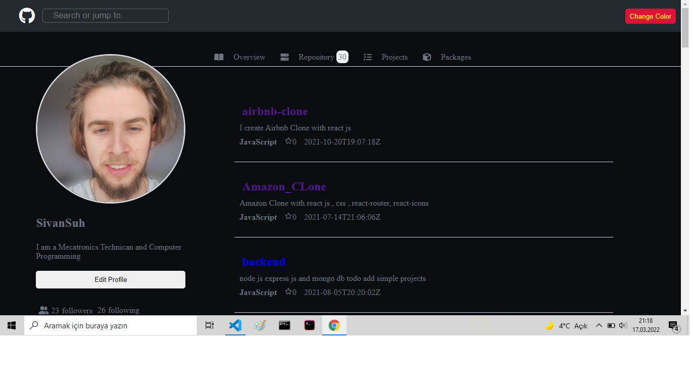

<h1>Github Search  Api Projects</h1>
<h2><a href="https://github-clone-search-api.netlify.app/" target="_blanck">Demo Link</a></h2>
 

 

 

<h2>Tools</h2>
<h3>React js</h3>
<h3>Pure Css</h3>
<h3>React Icons</h3>
<h3>React Router 6 </h3>
<h3>React Context for change theme </h3>
